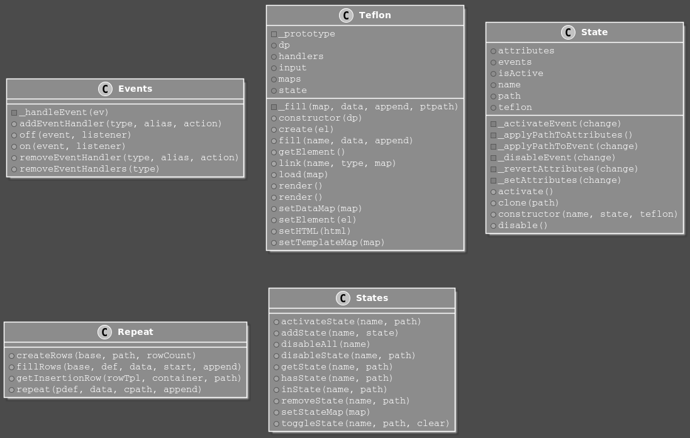

# Diagres

Tool to generate class diagrams from es2015 code.



Example usage:
```bash
DEBUG=diagres diagres --pattern 'src/*.js' > test.puml
```

The parser itself is not aware of all es7 features, so if you want to parse those you'll first have
to transpile the code and then point diagres at the transpile code.

e.g.
```bash
npm run your-build-process
DEBUG=diagres diagres --pattern 'dist/*.js' > test.puml
```

The parser looks for Class and Method Definitions, so make sure those have not been transpiled.

Example:
```coffeescript
$ diagres -p 'git/teflon/src/**/*.js' > test.puml # a project
@startuml

class Events {
-_handleEvent(ev)
+addEventHandler(type, alias, action)
+off(event, listener)
+on(event, listener)
+removeEventHandler(type, alias, action)
+removeEventHandlers(type)
}
class Teflon {  
  
etc...
```

To convert to a e.g. a .png:
```bash
$ dot -Tpng -otest.png test.puml
```

Useful plantuml plugin for WebStorm:

  https://github.com/esteinberg/plantuml4idea
